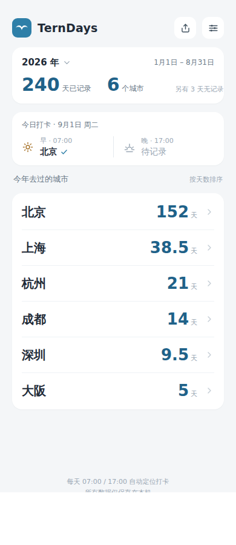
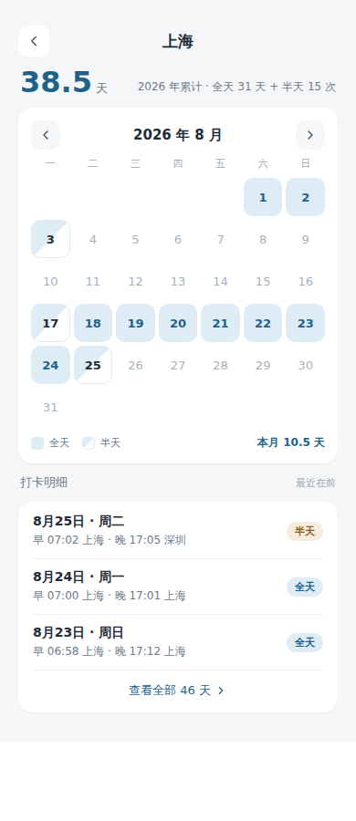
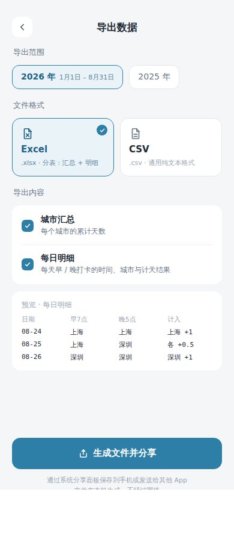
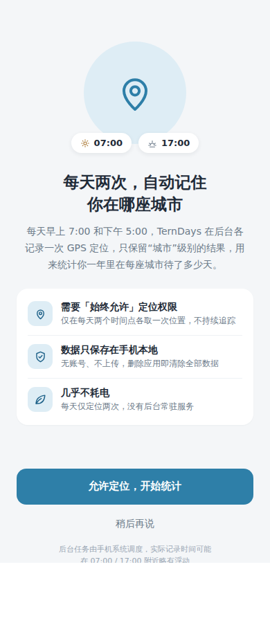

# TernDays 🐦

**统计你一个自然年里，在每座城市各待了多少天。**

每天早上 7:00 和下午 5:00 各自动记录一次 GPS 定位（只用 GPS，不用 IP——境外 SIM 卡 / 代理下 IP 不可靠），离线解析成城市，按年统计成「城市 × 天数」。所有数据只存在手机本地。

[](https://github.com/pekinlcc/TernDays/actions/workflows/android.yml)

| 首页 | 城市详情 | 导出 | 权限引导 |
| --- | --- | --- | --- |
|  |  |  |  |

*（以上为设计稿渲染图）*

## 计天规则

| 当天记录 | 计法 |
| --- | --- |
| 早、晚打卡在同一城市 | 该城市 **+1 天** |
| 早、晚打卡在两个城市 | 两城市 **各 +0.5 天** |
| 只有一次打卡（早或晚） | 该城市 +1 天 |
| 全天无记录 | 计入「无记录」，可在设置中手动补记 |

- 打卡时间按**手机当前本地时间**；跨时区旅行时监听系统时区变化自动重排闹钟。同一本地日期同一时段出现多条记录（向西飞）只取最早一条。
- 闹钟被系统推迟时在窗口内补打（早点 07:00–11:59，晚点 17:00–23:59），超窗记为无记录。

## 功能

- 📍 每天两次定点 GPS 打卡（精确闹钟 + 前台服务，每天仅定位两次，几乎不耗电）
- 🏙️ 完全**离线**的城市解析：内置 3.4 万个城市点位；国内按**地级市/直辖市**归并，境外显示城市中文名；
  深港/珠澳等真实边界逐点标定，打卡时用「候选边距 + 行程连续性 + 定位误差圈」交叉验证消除边界模糊
- 📅 首页年度「城市 × 天数」列表；城市详情页有月历视图（全天 / 半天标记）与打卡明细
- 📤 按年导出 **Excel (.xlsx)** 或 **CSV**（城市汇总 + 每日明细），本机生成走系统分享，不联网
- 🧩 **桌面小组件**（Android / iOS，2×2）：今年 Top 3 城市及天数，三行等权重；打卡后自动刷新（每天至多两次），跟随深色模式
- 🛡️ 打卡保障设置页：定位 / 后台定位 / 通知 / 精确闹钟 / 电池豁免逐项检测，内置小米、华为/荣耀、OPPO、vivo、三星等品牌的**自启动白名单**跳转
- ✍️ 无记录的日子支持手动补记；**任何一天都可手动更正城市**（首页「纠正」按钮 / 城市详情点任意一天），手动更正优先于自动判定、可恢复
- 🩹 城市库升级后自动按存量原始坐标**重解析历史记录**，修过的误判（如深圳被记成香港）覆盖安装即自动改回
- 📲 **换手机数据迁移**（Android ↔ iOS 互通）：旧手机展示二维码、新手机扫码，数据经一次性密钥加密后**局域网直传**，不经过任何服务器；合并导入不覆盖新手机已有记录
- 🌙 **深色模式**（双端）：跟随系统自动切换，小组件同步适配
- 🔒 无账号、无服务器、零联网（仅换手机迁移页面临时使用局域网点对点传输）；原始经纬度仅存本机，删除应用即清除
  - Android 的 `allowBackup` 保持开启：若你自己开了系统云备份（如手机厂商账号/Google 备份），系统可能把应用数据一并备份走；不想要可在系统设置里关闭该应用的备份

## 安装

### Android（优先支持）

从 [Releases](https://github.com/pekinlcc/TernDays/releases) 下载最新 `TernDays-vX.Y.apk` 安装。

- 最低 Android 8.0（API 26），目标 Android 15
- APK 用仓库内的自签名密钥签名（`android/signing/`，密码 `terndays`——个人应用，密钥仅用于安装校验，不是机密）
- 首次启动请按引导授予「始终允许」定位权限，国产 ROM 建议同时开启自启动白名单和电池豁免，否则后台打卡会被系统杀掉

### iOS（源码提供，待真机验证）

`ios/` 目录为 SwiftUI 工程，需要自行用 Xcode 构建（见 [ios/README.md](ios/README.md)）。iOS 不允许后台精确定时任务，采用「显著位置变化唤醒 + 每日本地通知 + 打开应用补打」的组合策略，打卡时间精度低于 Android。

## 构建

```bash
# Android（需 JDK 17；Android SDK 由 AGP 自动定位）
cd android && ./gradlew :core:test :app:assembleRelease

# 重新生成离线城市库（可选）
pip install geonamescache opencc-python-reimplemented
python3 tools/build_city_dataset.py android/app/src/main/assets/cities.tsv
```

CI（GitHub Actions）在每次 push 时跑单元测试并构建 APK。**发版**：把新版本号写进根目录 `RELEASE_VERSION`（如 `0.2`），并添加对应的 `docs/release-notes/v0.2.md`，push 后 CI 检测到该版本还没有 tag，就会自动创建 tag 并发布带 APK 的 GitHub Release（推 `v*` tag 或手动触发 workflow 也可以）。

## 已知限制

- 城市边界附近仍可能判给邻市（离线库按最近点匹配）。深港/珠澳（v0.5）与环京/环沪/广佛通勤带（v0.6.1：燕郊→廊坊、花桥→苏州、南海→佛山）已逐点修正并加交叉验证；遇到误判可直接在应用里手动更正（v0.7 起还能只改半天），原始坐标始终保留，城市库升级后历史记录按时间重放自动重解析
- 界面文案目前只有中文；平板/横屏未专门适配
- Android 后台打卡的成败强依赖系统调度：请务必完成「打卡保障」里的全部设置
- iOS 版本尚未在真机验证

## 版本号规则

从 **0.1** 起步：小功能改进 → 0.2、0.3…；bug 修复 → 0.1.1、0.1.2…；重大功能 / 架构或设计重构 → 1.0.0、2.0.0…。每个版本打 `vX.Y[.Z]` tag 并发布 Release。

## 数据来源与致谢

- 城市点位：[GeoNames](https://www.geonames.org/)（CC-BY 4.0，经 [geonamescache](https://pypi.org/project/geonamescache/) 获取）
- 中国省市区名录：[modood/Administrative-divisions-of-China](https://github.com/modood/Administrative-divisions-of-China)
- 繁简转换：[OpenCC](https://github.com/BYVoid/OpenCC)

## 许可

代码以 [MIT](LICENSE) 发布。内置离线城市库派生自 **GeoNames**（CC BY 4.0）与
**modood/Administrative-divisions-of-China**（WTFPL），详见 [LICENSE](LICENSE) 中的第三方数据条款。
